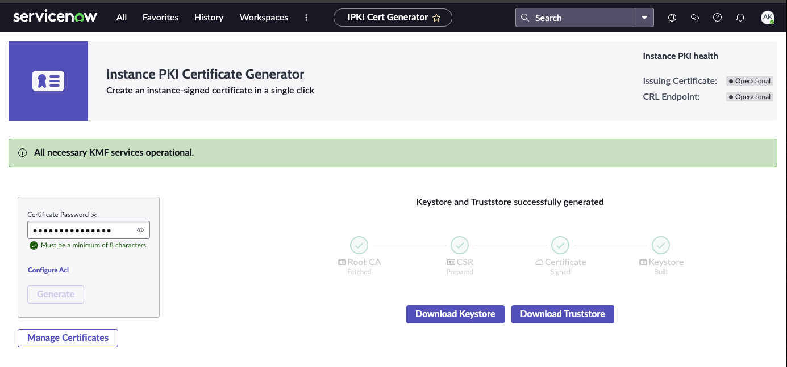

# Application configuration
Key configuration variables are loaded at runtime from a file named `.env` which is not included with
this repo since that may contain security information. Copy the file named `env_sample` to `.env` and
fill in values as you go through this process.

# Create Certificates
In your ServiceNow instance, navigate to `All -> Certificate Generator -> Instance PKI Certificate Generator`.
- Provide a password for the certificate you're going to generate
- Download the keystore (`keystore.p12`)
- Download the Truststore (`truststore.p12`)



# Turn Java keystores into PEM files
ServiceNow exports keys in Java Keystore format but the python library expects PEM format. We need to extract the keys from `keystore.p12` and `truststore.p12` in the right format. 

## Prerequisites

- `keytool` (comes with Java JDK)
- `openssl` (usually pre-installed on macOS/Linux, or available via Git Bash on Windows)

## Extract CA certificates from truststore.p12
Extract all three certificates from truststore.p12 into a single PEM file:

```bash
# Export all CA certs into a single PEM file
keytool -exportcert -alias "digicert root certificate" \
  -keystore truststore.p12 -rfc -file ca-cert.pem \
  -storepass password_you_used_when_you_created_it

keytool -exportcert -alias "digicert issuing certificate" \
  -keystore truststore.p12 -rfc -storepass password_you_used_when_you_created_it >> ca-cert.pem

keytool -exportcert -alias "entrust certificate" \
  -keystore truststore.p12 -rfc -storepass password_you_used_when_you_created_it >> ca-cert.pem
```

## Extract client certificate and private key from keystore.p12

```bash
openssl pkcs12 -in keystore.p12 -nodes -nocerts \
  -out client-key.pem -passin pass:password_you_used_when_you_created_it

# Export everything including chain
openssl pkcs12 -in keystore.p12 -nokeys \
  -out client-cert-chain.pem -passin pass:KevinKevinKevin
```

## Update your .env file

```bash
SSL_CA_FILE=./certs/ca-cert.pem
SSL_CERT_FILE=./certs/client-cert-chain.pem
SSL_KEY_FILE=./certs/client-key.pem
```

## Troubleshooting

**"no certificate or crl found" error:**
- Verify the CA certificate file exists and contains valid certificates
- Check that you extracted all certificates from the truststore

**"certificate unknown" error:**
- Ensure you extracted the full certificate chain (use `-nokeys` not `-clcerts`)
- Verify the certificate hasn't expired: `openssl x509 -in client-cert-chain.pem -noout -dates`

# Get information for your connection
## Bootstrap urls
- In your ServiceNow instance, navigate to `All -> Hermes Messaging Service -> Diagnostics`
- Expand the `Setup Information` container. 
- Copy the Consumer Bootstrap 1 and Consumer Bootstrap 2 information.

## Update your .env file

```bash
CONSUMER_BOOTSTRAP_1="comma,separated,list,of,hosts"
CONSUMER_BOOTSTRAP_2="different,comma,separated,list,of,hosts"
```

# Application setup
If you are using a python virtual environment, initialize your python environment 

`source bin/activate`

Install app dependencies with

`pip install -r requirements.txt`

Run the application

`python app.py`

More detailed logging

`LOG_LEVEL=DEBUG python app.py`